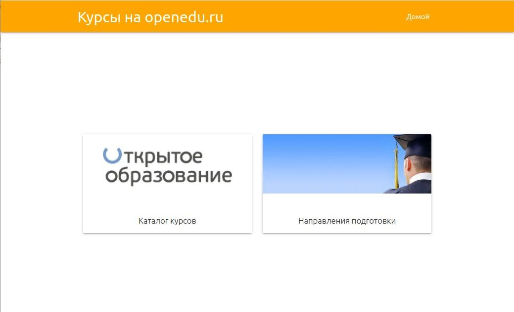
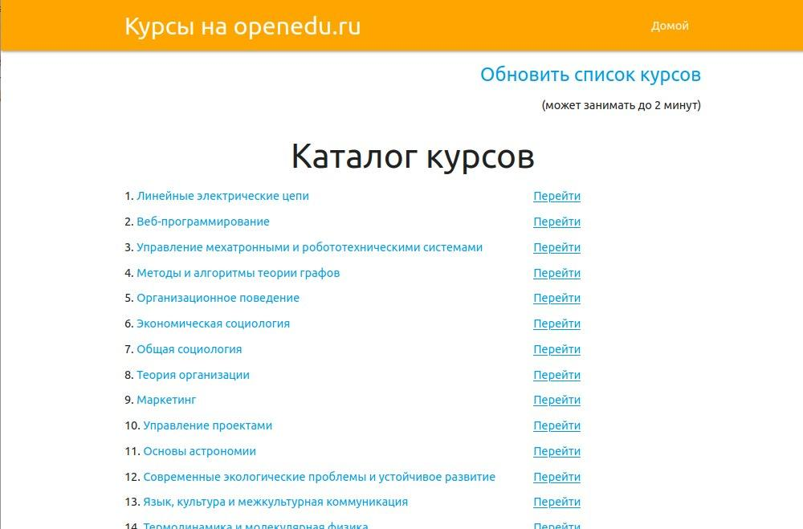
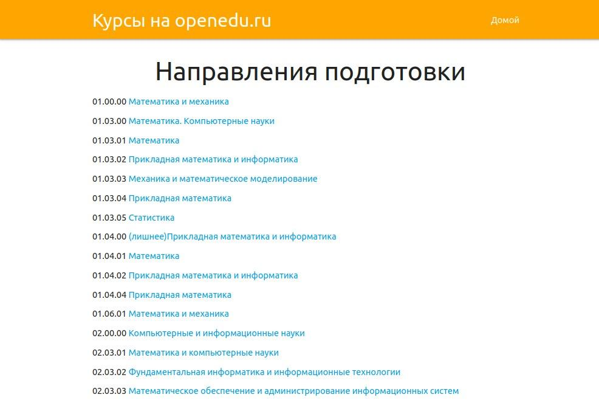
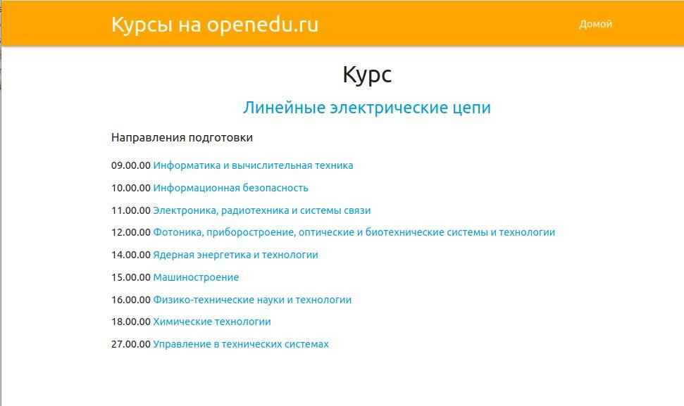

# Парсер курсов с openedu.ru на Django
Парсинг каталога курсов с `openedu.ru` и их отображение. Парсинг работал на ноябрь 2019 года, но затем структура сайта изменилась, и теперь **парсер не работает**)  
Но база курсов сохранилась в БД `db.sqlite3`, поэтому они все отображаются, и их можно посмотреть.

## Установка необходимых пакетов
Необходимо установить Django, выполнив простую команду ниже. Запускалось с версиями Django с 2.* по 4.*  
`pip install Django`

## Запуск веб-приложения
```
python manage.py runserver
```
Затем переходите по ссылке в браузере [http://127.0.0.1:8000/](http://127.0.0.1:8000/). 

## Интерфейс веб-приложения  
### Главная страница сайта  
  

### Каталог курсов  
Обратите внимание, что кнопка `Обновить список курсов` не работает.  
  

### Список направлений подготовки
  

### Описание курса  
  

